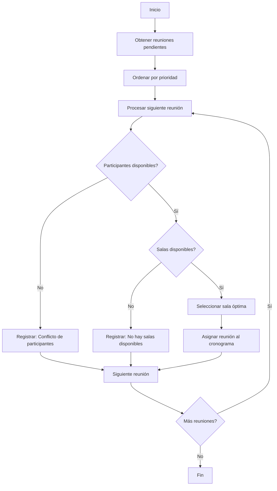

# Sistema de Optimización de Salas de Reuniones

Sistema desarrollado en PHP con arquitectura MVC para optimizar la asignación de salas de reuniones considerando disponibilidad de participantes, recursos necesarios y capacidad de salas. Optimizado para PostgreSQL.

<div align="center">
  
  
  
  
</div>

## Descripción

Este sistema da solución al **Problema 02: Optimización de Salas de Reuniones** (ver [Problema 02 - Optimización de Salas de Reuniones.md](Problema%2002%20-%20Optimización%20de%20Salas%20de%20Reuniones.md) para detalles completos).

> Para la implementación detallada y estándares técnicos, consultar: [ESPECIFICACIONES.md](ESPECIFICACIONES.md)

## Funcionalidades Principales

### Gestión de Salas y Recursos

```php
// Ejemplo básico de gestión de salas
$sala = SalaModelo::obtener_por_id($sala_id);
$disponibilidad = SalaModelo::verificar_disponibilidad($fecha, $hora_inicio, $hora_fin);
```

### Algoritmo de Optimización

```php
// Ejecución del algoritmo de optimización
$resultado = PrincipalModelo::optimizar_asignacion();
$max_reuniones = PrincipalModelo::calcular_maximo_reuniones($fecha);
```

## Modelo de Datos

El sistema implementa una base de datos PostgreSQL con tablas para:

- **Salas**: Información de salas disponibles y capacidad
- **Recursos**: Recursos disponibles (proyector, videoconferencia, etc.)
- **Participantes**: Información de usuarios que asisten a reuniones
- **Reuniones**: Datos de reuniones programadas
- **Cronograma**: Asignación final de salas a reuniones

> La estructura completa de la base de datos se encuentra en `app/models/sql/schema_postgresql.sql`

## Optimización del Algoritmo

El algoritmo implementa una estrategia de priorización ponderada:

```php
// Cálculo de puntuación para priorizar reuniones
$reunion['puntuacion'] = ($duracion_minutos * 0.6) +
                         ($num_participantes * 0.3) +
                         ($recursos_especiales * 0.1);
```

## Diagramas

### Diagrama de Flujo



> [!WARNING]
>
> Este proyecto es una implementación educativa. Para un entorno de producción, se recomienda implementar medidas adicionales de seguridad y optimización.

## 🥷 Autor

<a href="https://github.com/hk4u-dxv">
  
</a>

<div align="center">
  <p>Desarrollado como solución al ejercicio de optimización de salas de reuniones.</p>
  <p>Proyecto educativo de arquitectura MVC con PostgreSQL.</p>
</div>
